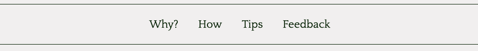
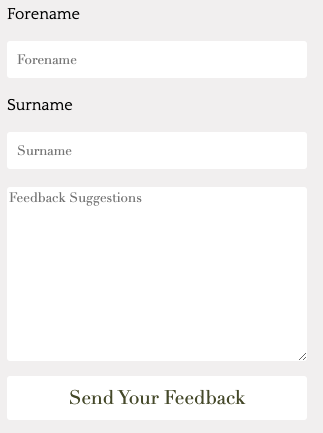

# A Perspective on meditation

A Perspective On Meditation is a site which covers the benefits of meditation, how one does meditate and also includes tips for how do get a meditation practice going. But it's focus is not merely on meditation, is also covers basic cognitive tendency’s, how meditation can be a tool for mental health and it can also be a source for understanding the often not very pleasant thoughts many of us face from time to time. The target group is anyone who is interested in meditation, people who suffer from mental health issues as well as people which have a hard time dealing with their thoughts.  
 

# Wireframes

## index.html

## how.html

)

## tips.html

## feedback.html

# Existing Features

* The site has an easy to understand non-distracting layout needless of device.
* The site is fully responsive and works well on everything from large screens to cellphones.

## Navigation bar

The site has two navigation bars. One at the top the pages, and one in the footer, this will enable smooth transitions between the pages needless of device. 

## Footer 

The footer in addition to the navigation also holds the name of site as well as social media links and a link to Spotify where a mediation playlist or a future company account with several playlists potentially could be the destination.

## Landing page

The Why Meditate page is the landing page. 

* This page purpose is to convey reasons as to why someone would start a meditation practice. 
*The function of the associated image is to convey that mediation can have a calming effect on a person’s life.

## Second page

The second page is the How To Meditate page. 

* The page purpose is to convey how to meditate, different ways to meditate and how to treat and interpret the thoughts that inevitably will appear. 
* The videos purpose is to display one of the meditation techniques which is explained on the page.

## Third page

The Third page is the Meditation Tips page. 
* The purpose of the page is to propose tips for how to create the habbit, keep going and ways to better understand why thoughts apear. 
* The three gallery images are representations of the contents different tips.

## Fourth page

The Forth page is the Improvments page. 

* The purpose of the page it so let readers critique the content and present ideas to improve and expand the content of the site. This is done trough a form. 
* The pages also has a map which purpose is to welcome individuals from all backgrounds to participate in the improvment of the website. 

# Future Features

Developing the site based on the critique and ideas the members put forth.

Add a newsletter which would cover topics relevant to the site.

Add a membership section with a forum for readers to engage with one another about meditation, mental health and cognition. This could be useful to lots of people, likely especially to people who suffer from mental health issues but have no one to talk to and can’t afford a psychologist.

 # Testing

 ## HTML

 ### index.html 

 * Becasue of how to the content was written several headings in not an option
 * The stray nav and stray tags was removed

 

### how.html

* Because of how to the content was written several headings in not an option
* The alt was removed
* The stray tag was removed
 
 

### tips.html 

* All paragagraps have headings on this page, not obvious why this warning exists 
* Stray nav and scripts tags was removed
 

### feedback.html

## CSS

* A semicolon was forgotten, now added
* Display was pushed down to a seperate row 
* By mistake align-items was written instead of align-content, now fixed
* Padding-top was removed

### Device testing

* Tested on Google Chrome, Firefox and Safari without issues
* Tested on 24 inch screen (Mac OS) without issues
* Tested on 13 inch laptop (Mac OS) without issues
* Tested on 7 year old tablet (Android), the first font-family choice Didot was not supported, likly due to old chrome browser.  Otherwise no issues
* Tested on cellphone (IOS) without issues

## Unfixed Bugs

Flexbox refused to accept bottom of footer, insted flex-end ended up in the middle of the footer due to the other content in the footer above it. The issue was fixed through padding, there is likly better options available that the author was not able to figure out during the projects timeline.

The footer stretches on smaller screens sizes, it's som how connected to the gallery and the gallery realigning with the flex-wrap: reverse-wrap command. Without the added padding there is a white space under the footer.

# Deployment

1. In the repository hompage on github select settings
2. In the options field on the left  select pages
3. In the source branch field, select master (none is default)
4. Optional to choose a theme (none was chosen)
5. Make sure the Enforce HTTPS box is checked
6. Click save to publish

 Here is a link to the finished website [A Perspective On Meditation](https://carlssonoscar.github.io/a-perspective-on-meditation/)

# Credits

The code which made the image on index.html and video on how.html responsive was found on [Stack Overflow](https://stackoverflow.com/questions/42816324/responsive-images-with-flex), it was later on modified to fit the site.      

The code for the footer media-logos was borrowed from the [Love Running](https://learn.codeinstitute.net/courses/course-v1:CodeInstitute+LR101+2021_T1/courseware/4a07c57382724cfda5834497317f24d5/e6d4cda2bc08458ba94d2092be9bad3a/) Code Institute project.

# Content

Content was written by the author and edited by two of his friends to ensure as few spelling and grammar mistakes as possible.

Social media and other logos was obtained through [Font Awesome](https://fontawesome.com/).

The iframe necessary for the map was obtained through [Google Maps](https://maps.google.com).

# Media

The images and video was obtained through [Pexels](https://pexels.com/).

The iframe necessary for the map was obtained through [Google Maps](https://maps.google.com).

# Acknowledgements 

[Code Institute](https://codeinstitute.net) for providing excellent course material.

[W3 Schools](https://w3school.com) has been an aditional valuable source for learning how to code.

[Flexbox Froggy](https://www.flexboxfroggy.com) provided an excellent introduction to the basics of Flexbox.
